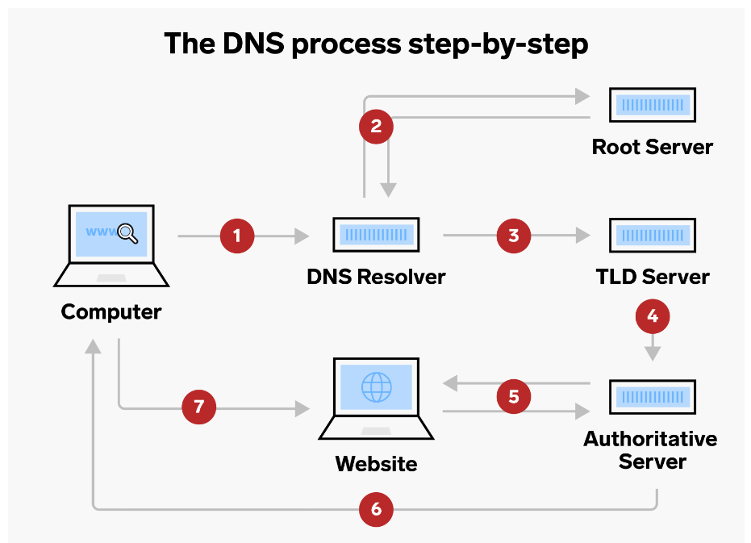

# Domain Name System

> I think the basic to know before starting the web development, is to know how the web works.

You type “www.google.com” into your browser, and like magic, the Google homepage appears. But have you ever wondered 
how your computer knows where to find Google in the vast ocean of the internet? Enter the unsung hero of the online world — the 
Domain Name System (DNS) server. Let’s embark on a journey to demystify DNS, uncovering the behind-the-scenes ballet that brings you 
seamlessly to your favorite websites.

### Understanding the Basics

Think of a domain like a friend’s address — easy for you to remember. However, computers speak in a different language, using 
numerical IP addresses. When you type a domain like `www.google.com`, your computer turns to the DNS server, asking, “Where’s Google 
at?” The DNS server then translates the human-friendly domain into a machine-readable IP address, like `192.0.2.44`.

### The Translation Process

It’s like having a personal translator for the internet. Your computer sends a request to the DNS server, saying, “I need Google!” 
The server responds, “Google? Sure, that’s at `192.0.2.44`.” Now armed with the correct address, your computer connects to the Google 
server, and voila, the webpage appears on your screen.

if we go more deeper to understand the process, here is a high level architecture which brings you the Google

the DNS resolver’s first step is to find the TLD (top level domain). which basically stores all the domains with the same extension 
(.com, .in,…) — once it knows the TLD, either .com or any other , it searches for the right IP address.

Once the TLD is conquered, our DNS resolver hero hunts down the right IP address, the golden key to the website’s location. 
Triumphantly, it hands this precious information to the Authoritative Server — the wise sage who holds the secrets to the specific 
domain’s whereabouts in the vast internet realm.

The grand finale! The DNS resolver sends a request to the verified IP address. If the IP responds with the exact data needed, it’s a 
match made in cyberspace. With a satisfied nod, the DNS resolver hands over the correct IP to your web browser, conjuring the 
requested webpage onto your screen like magic.

In the symphony of the internet, DNS servers are the composers ensuring harmony between human-friendly domains and computer-friendly 
IP addresses. They’re the navigators steering your requests through the web’s intricate pathways, making sure you reach your desired 
destination without a hitch. Next time you effortlessly surf the internet, remember the invisible hand of DNS servers, making the 
magic happen behind the scenes.

Now, here’s where the magic gets even more interesting. To avoid the tedious process of searching for the same information every 
time, DNS servers employ a clever trick called caching. Once the DNS resolver finds the correct IP address, it stores this 
information in a cache — a sort of digital memory. So, the next time you make the same request, the DNS server simply retrieves the 
information from its cache, skipping the elaborate journey and speeding up the entire process.

To speed things up, DNS servers remember recent translations. The first time you visit a site, the DNS server does the hard work. 
But for subsequent visits, it already knows the way, fetching the information from its memory cache. This nifty trick reduces the 
time it takes to load your favorite sites

I appreciate you joining me on this adventure. If you have any questions, share your thoughts, or want to dive deeper into 
development and foundational domain knowledge, feel free to drop a comment below. Your feedback is invaluable!

Happy coding!