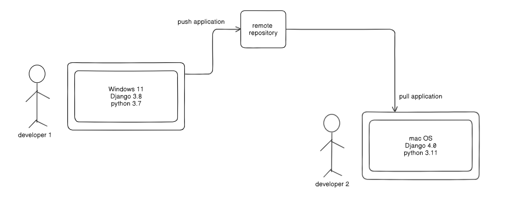
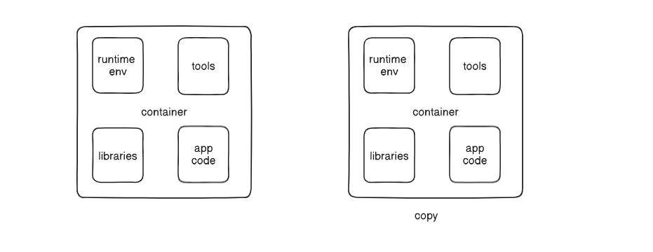
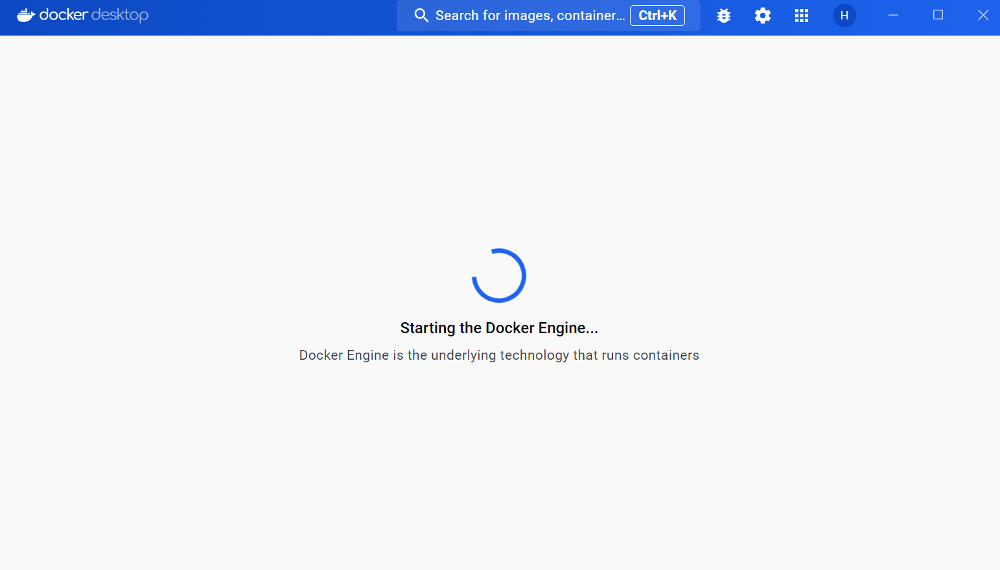
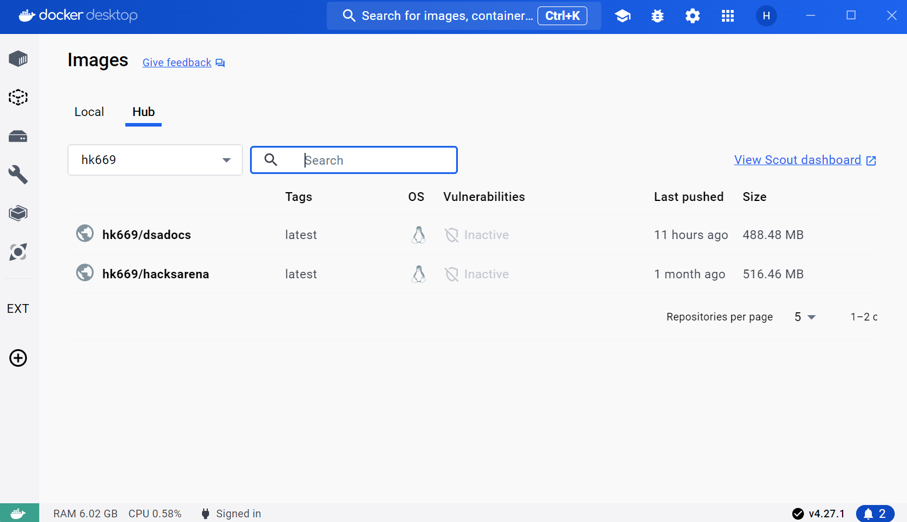

# Docker 🐳

In this blog, we'll delve into why Docker is a crucial tool for modern software development and how to effectively utilize it. We'll cover Docker from the basics to advanced usage scenarios, exploring its benefits and practical applications.

### Problem Statement
Consider a common scenario: a developer is working on a Django application on their local machine. To run the application successfully, certain requirements and dependencies need to be installed, such as:

```
Django 4.0
Python 3.1.0
```

??? note "dev meme"

    dev2: its not working? 
    
    dev1: but it works on my computer

---

The application runs smoothly on the developer's local environment. However, as time passes, the developer pushes the application code into a remote repository. Months or years later, another developer wants to clone the repository and use the application. Here lies the main problem:



<!-- more -->

### Dependency Management and Environment Consistency:

The new developer may not know all the dependencies required to run the application.

Even if they manage to gather the dependencies, there's no guarantee that their local environment matches the specifications of the original developer's environment.

Any discrepancies in dependencies or environment configurations can lead to runtime errors and inconsistencies, making it challenging to run the application smoothly.

so we use docker to build a container.
which will carry :

- Operating system (runtime environment)
- tools
- libraries and dependencies

if there are multiple developers or a team working on the same application, but everyone has a different config, the container can be copied and used on thier machine.

!!! warning "note"

    running a container will not affect the installed dependencies on local machine of the developers.
    Each container operates in isolation, ensuring that changes made within the container do not impact the host system.



### Benefits of Docker

**Isolation**: Docker containers provide a high level of isolation, ensuring that applications run predictably regardless of differences in the host environment.

**Portability**: Docker containers are portable and can be easily moved between different environments, streamlining the deployment process.

**Efficiency**: Docker uses a layered filesystem and smart caching mechanisms, resulting in faster build times and reduced storage overhead compared to traditional virtual machines.

By leveraging Docker, developers can simplify dependency management, ensure environment consistency, and streamline the deployment process for their applications.

### Components of Docker

**Docker Engine**: It is the core component of docker, which is lightweight runtime and orchestrator which manages the containers, runs their lifecycle and provides networking and storage capabilities.



!!! note

    Docker daemon (`dockerd`) which runs on the host machine and the Docker client, a cli to interact with Docker daemon

**Docker Image**: where the code is stored or the runtime envs are stored. Image is a lightweight, standalone and executable package which stores all the necessary files required to run the application.



??? note

    - Immutable
    - Layered File system
    - Stored in Registry

**Docker Container**: It is a runnable instance of the Image we built for an application. which encapsulates all the necessary files, dependencies required to run the application

??? note

    containers have a life cycle, which means:

    - Start
    - Stop
    - Delete

**DockerFile**: the maker of the Image, a file with set of instructions on how to build the Image. Contains dependencies, base image, env variables to build an image

- To build an Image we use `docker build`

**Docker Registry**: Docker registry is a repository for storing and sharing Docker images. It serves as a centralized location where developers can push and pull images, making them accessible to other users and systems.

??? tip

    Docker Registry is similar to GitHub.

    checkout my [Docker Hub](https://hub.docker.com/u/hk669), Built an Image of the documentaion site, can pull and contribute anyone who's interested.

**Docker Compose**: Docker Compose is a tool for defining and running multi-container Docker applications. It uses a YAML file (docker-compose.yml) to define the services, networks, and volumes needed for an application.

- Docker Compose is an advanced topic we'll cover it when we dive deep into the orchestration.

### Conclusion

I think its a good start to understand what is Docker and why we use it. As a developer understanding the stuff like Containers and isolation will help you in the long journey. 

Thank you for your attention and interest until now. will soon drop a video showing the live interaction with all the components for better understanding.

??? warning "Announcement"

    I dropped a documentation for my DSA solutions of leetcode problems. please feel free to checkout the site.
    [link](https://dsa.hrushikesh.xyz)