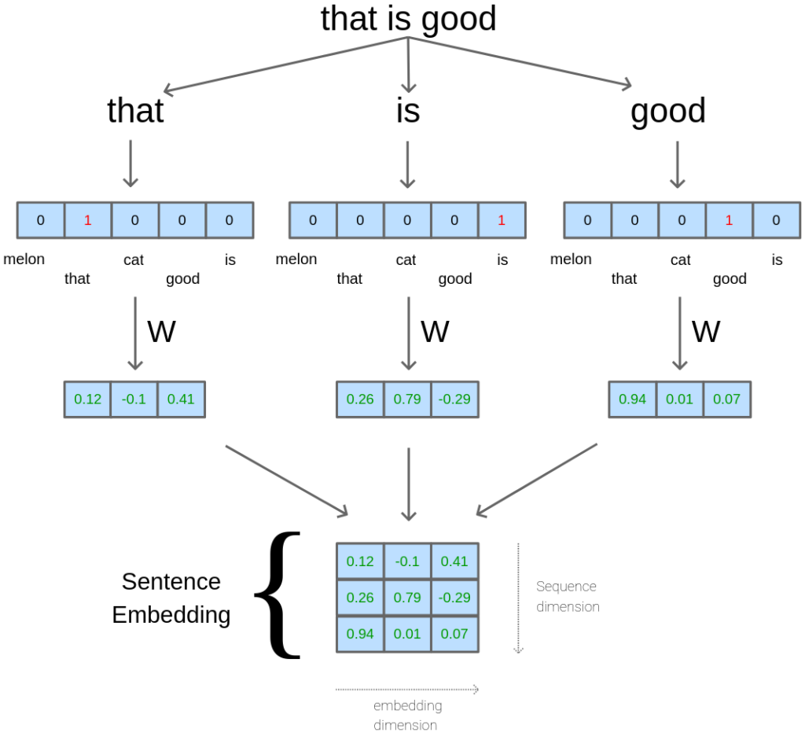

# Lets talk about LLMs 

### My experience with LLMs

I've explored a variety of Large Language Model(LLMs), ranging from the commercial GPT-4, gemini-pro to open source 
alternatives like Mistral-7B and GPT-3.5-turbo.
Additionally, I've also explored the smaller language models, like phi-2 of Microsoft which is also an open source model 
which is trained on just 2.7B params.

Amongst these, gpt4 stands out for its efficiency and the response generation. as per my knowledge, I think there's no llm 
that has matched the quality of GPT-4 responses but the information is limited to 2022.

I recommend using the gemini-pro for the more updated informtaion and faster response compared to GPT-4.

### What are LLMs
Large Language Models, are AI models trained on large text datasets which include articles, books, and other texts.
<!-- more -->
 They utilize the **transformer** architecture, to understand and generate text. These models can perform a wide range of 
 language-related tasks, including language translation, text summarization, question answering, and natural language 
 understanding.

i understand, the architecture is too overwhelming. we'll get a detailed overview on the transformer architecture in the 
next blog. check out the [paper](https://proceedings.neurips.cc/paper_files/paper/2017/file/
3f5ee243547dee91fbd053c1c4a845aa-Paper.pdf) for more details.

### What exactly the LLMs do

Large Language Models excel in generating text that is coherent, contextually relevant, and grammatically correct for an 
user's query. They can also perform a wide range of language-related tasks, including language translation, text 
summarization, question answering, and natural language understanding.

I'll give a small overview on how internal architecture perform the generation and predicting the next word.
LLMs consist of two components

#### Encoder
 the encoder is responsible for processing the input text and converting it into a high-dimensional(*embeddings*)   
 representation that captures its semantic meaning and contextual information.

 the encoding phase, the LLM processes the input text token by token, generating contextualized embeddings for each token. 
 These embeddings contain rich information about the input text and are used as input for the subsequent decoding phase.

#### Decoder

The decoder component in LLMs is responsible for generating coherent and contextually relevant responses or continuations 
of the sentences based on the encoded input text.

While LLMs are primarily trained for autoregressive language generation tasks (i.e., predicting the next token in a 
sequence given the preceding context), the decoding process is more complex than in traditional sequence-to-sequence 
models. LLMs often employ sophisticated decoding strategies, such as beam search or nucleus sampling, to generate diverse 
and fluent responses. 

??? note "info"

    *Beam search* is a heuristic search algorithm used to find the most likely sequence of tokens in a probabilistic model.

    *Nucleus sampling*, also known as top-p sampling or softmax sampling with a dynamic threshold, is a probabilistic 
    sampling technique used to generate diverse and fluent sequences.

### Conclusion

In conclusion, Large Language Models (LLMs) represent a significant advancement in artificial intelligence, offering remarkable capabilities in understanding and generating human-like text.

While each LLM may have its own strengths ad=nd limitations, but the final goal is to generate correct, contextual and relevant information for the user query

The main problem that is faced is the **biasness** and the **hallucination** of the information. they pretend to know 
the information but they don't. same as humans, when they dont know the answer, they fabricate the responses and believe that the 
answer is true leading to misinformation and inaccuracies. 

One promising solution to mitigate hallucination is **Retrieval Augmented Generation**. 
By incorporating retrieval-based methods into the generation process, LLMs can access external knowledge sources to enhance
the accuracy and relevance of their responses.
