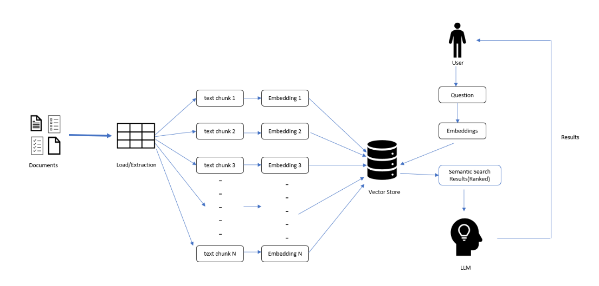
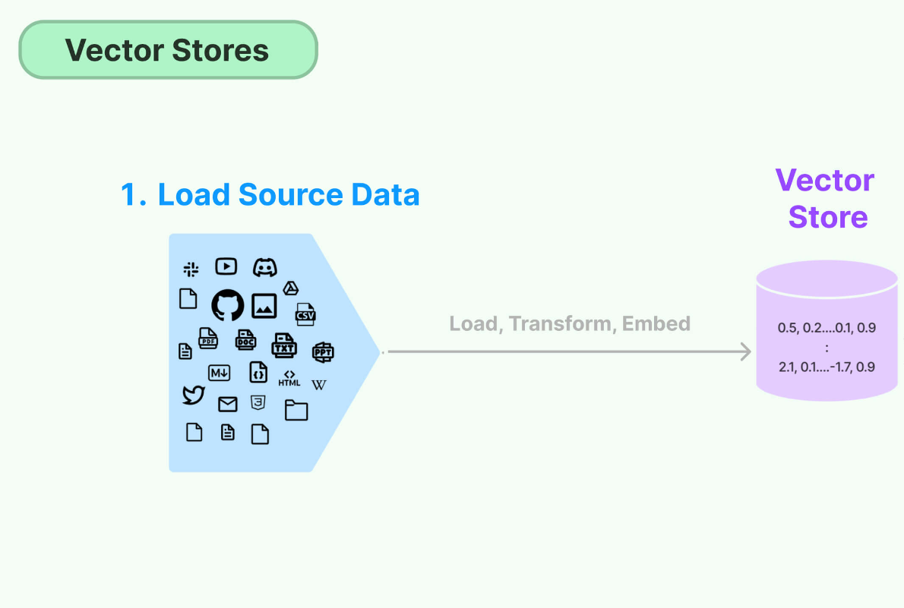
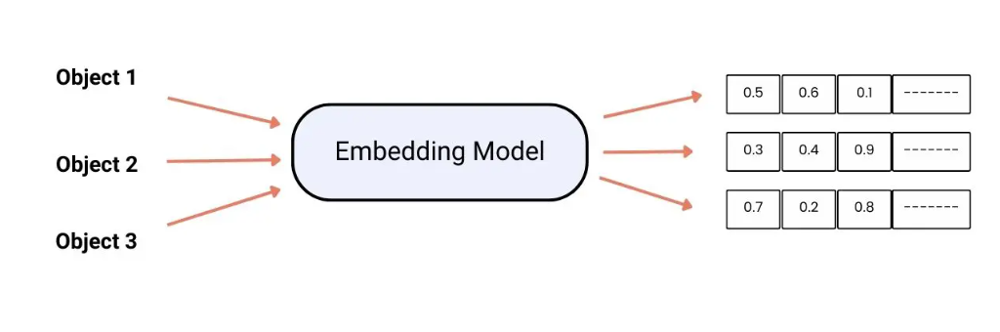

# RAG

## What interested me in doing this...

I was really interested in AI, which is literally the most important tool to enhance everyone's life and solve real-time problems that require significant human resources. By replacing them with AI, we can address all these issues.

I became interested in building projects around the APIs of models, GPTs, and OSS models. When I was a beginner, it seemed really cool to generate new content from foundational models. However, when I asked real-time questions or something outside the model's training data, I often received default answers like, "I'm only trained on data up to 2022."

This made me question: what are the ways I can train the foundational model on real-time data and make it available for users? This curiosity led me to delve into fine-tuning, which involves training the foundational model on your private data.
<!-- more -->

I know that fine-tuning foundational models requires more capital, which prompted me to explore OSS models. I understood that training OSS models requires more specifications for my laptop.

As an enthusiast in solving these problems, I was introduced to RAG.

## What is RAG?

RAG stands for Retrieval Augmented Generation. I know it's such a fancy name, and it does fancy stuff too. While understanding this, let's delve into a pictorial understanding of how it's efficient for developers interested in AI and companies seeking to automate their customer support.

let's understand the architecture behind the RAG...

### Vector Stores

Okay, imagine you've got this gigantic library, but instead of books lining the shelves, it's filled with these abstract representations of information, called vectors. Each vector is like a unique fingerprint, containing all sorts of details about a piece of data, whether it's a fact, a concept, or something else entirely.

Now, what makes these vector stores so cool is that they're organized in a way that makes it super easy for the system to find exactly what it needs. So when you ask a question, it's like the system knows exactly which shelf to pull from to find the answer you're looking for.

### Embedding Models

Think of embedding models as the translators of the AI world. They take all kinds of raw data, like words, sentences, or even images, and convert them into these neat little packages of information called embeddings.

These embeddings are like distilled versions of the original data, containing just the essential bits needed to understand what it's all about. So when the system needs to figure out what you're talking about or find related information, it can rely on these embeddings to make sense of things.

### LLM

Now, let's talk about the Language Model (LLM). This is where the magic really happens. It's like having a super-smart friend who's not only great at understanding what you're saying but can also come up with responses that sound totally natural.

The LLM is powered by some seriously advanced technology, using all sorts of clever tricks to generate text that's not just accurate but also fits seamlessly into the conversation. So whether you're asking a question or having a chat, the LLM's got your back.

RAG brings together these components in a seamless manner, allowing for efficient retrieval and generation of content. By leveraging real-time data and advanced AI techniques, RAG represents a significant leap forward in the field of content generation.

this is it for the blog, hope y'all understood how the RAG works, try implementing some stuff around this concept and you'll be familiar with the detials of the architecture. the most used framework for building such applications is [LangChain](https://python.langchain.com/docs/get_started/introduction). 

GitHub Repo for reference: [Link](https://github.com/Hk669/discordAI-bot)