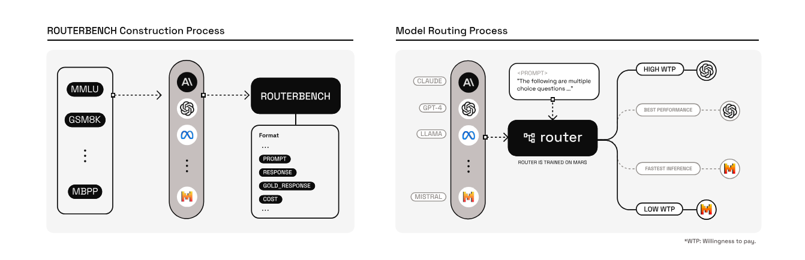
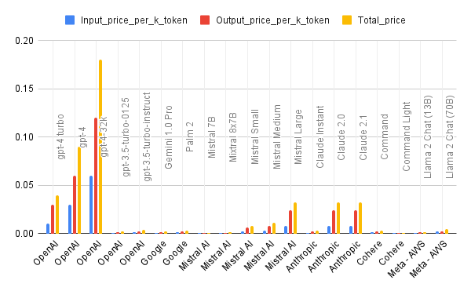
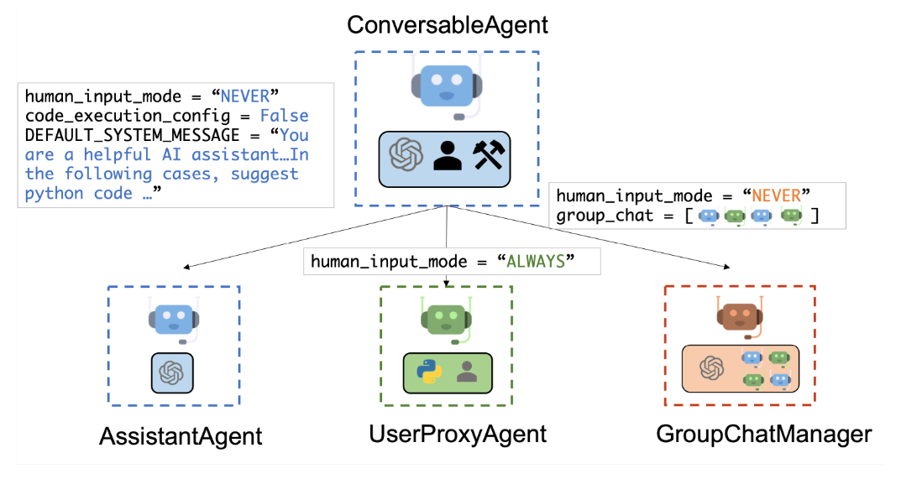
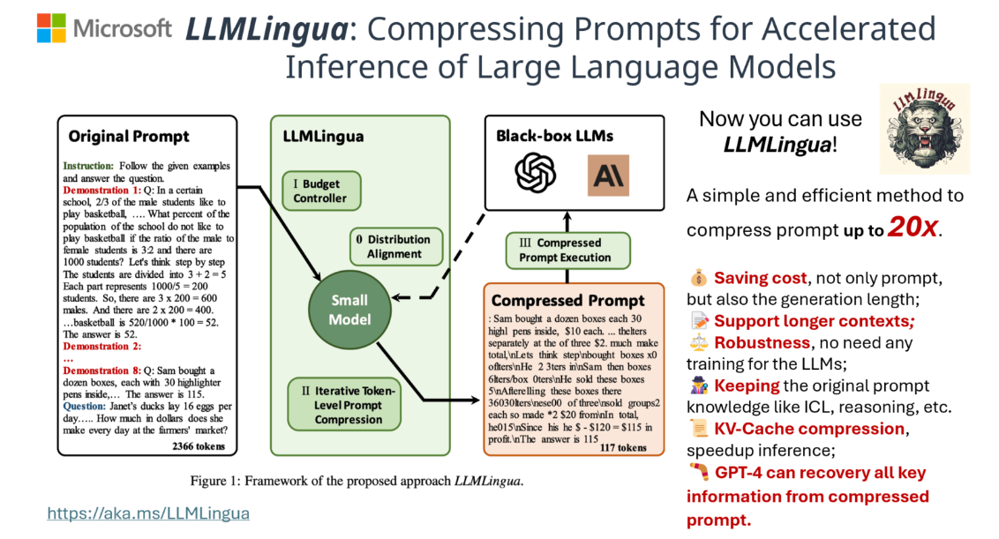

# How to reduce almost 80% of LLM costs

If you are an AI developer or building a SAAS wrapped around AI foundational models, its really necessary to think about spending a lot of money on LLMs without any prior knowledge on how to reduce these costs..

<!-- more -->

### Change the Model

By replacing the LLM like GPT-4 with a small language models like phi-3 or Mistral for specific tasks that doesn't need more precise and optimized responses. this way you can have major cost cuttings.

### LLM Router

Use different models for different tasks, use the SLMs (Small Language Models) for interacting and intial tasks. If the SLMs couldn't provide a better response for the user prompt, In this case send the user prompt to LLMs to generate a more consice and efficient response.

as mentioned in the latest paper [ROUTERBENCH: A Benchmark for Multi-LLM Routing System](https://arxiv.org/pdf/2403.12031)

### Multi-Agent Setup

As been a contributor to the AutoGen framework (Microsoft), i believe the multi agent setup can solve much more broader use cases than using a single model like GPT4, etc.. 

- Every agent can be powered with a different LLM
- Can add multiple agents into a groupchat making it much more diverse
- You can also use the function calling to call you external APIs
- Making it cost effective

This allows us to only allow agents which need lot of understanding and solve critical problems be backed by the powerful LLMs(GPT4)

### LLM Lingua

LLM Lingua is a method introduced by Microsoft that focuses on optimizing the input and output of large language models. By removing unnecessary tokens and words from the input, you can significantly reduce the cost of running the model. This method is particularly effective for tasks such as summarization or answering specific questions based on a transcript.

- Reduces the cost on input tokens
- Uses the small model to compress your prompt and then pass it to the LLM
- This adds more meaning and value to your prompt

As a Lead GenAI Consultant at [VEnableAI](https://venableai.com), we provide a comprehensive array of services, including AI Agents Workflow and chatbots, designed to optimize performance and maximize results while minimizing costs.
