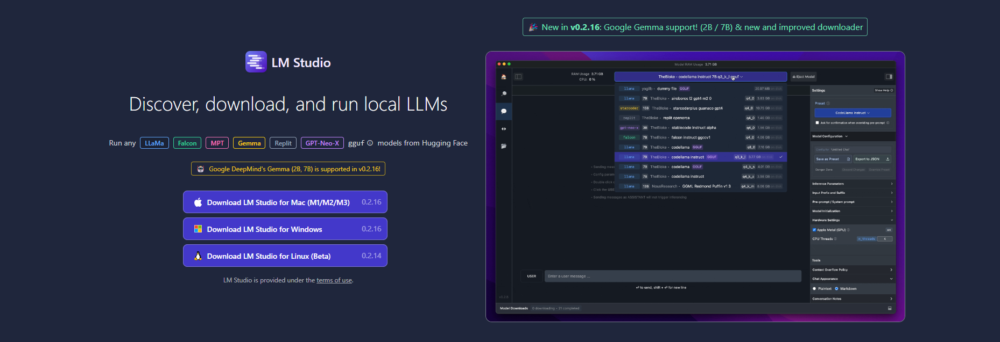
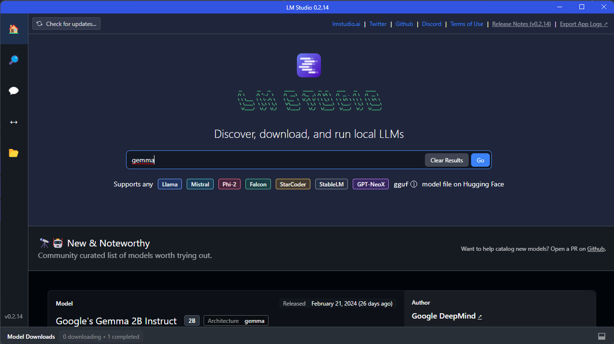
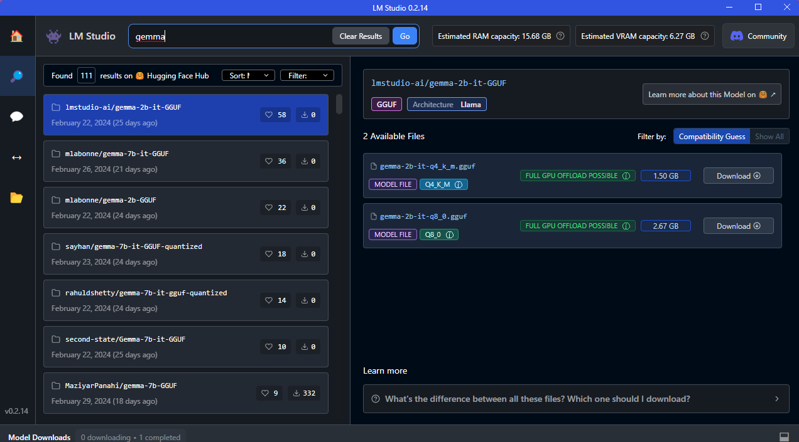
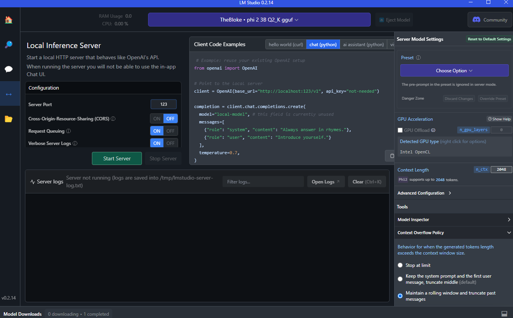
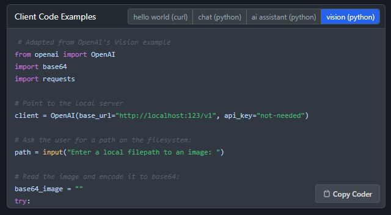
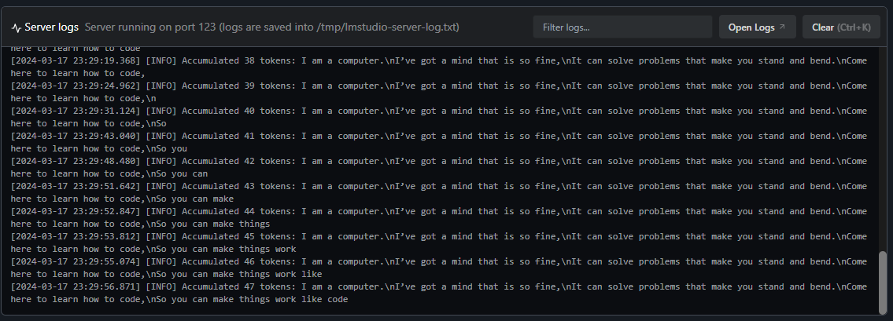
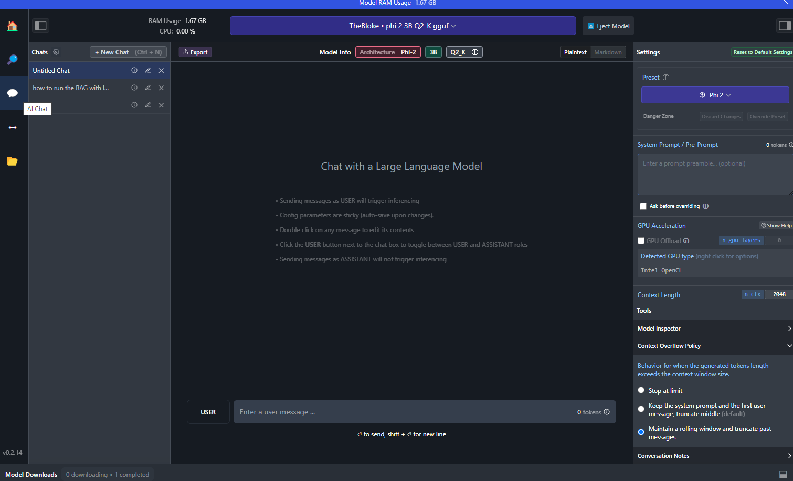

# How to Make the Best Out of Open-Source LLMs

Ever found yourself wondering if you could tap into the magic of top-notch language models without breaking the bank? Well, good news – open-source LLMs like **Gemma, Mistral, Phi2**, and a bunch of others are here to save the day! And guess what? They won't cost you a single penny. If you're scratching your head about how to get them up and running on your own machine and use them for all sorts of cool stuff, you're in the right place. Let's dive in!

## Why Bother with Open-Source LLMs?

Okay, so GPT-4 is like the rockstar of AI models, but let's be real – it's got a pretty steep price tag attached. And for us students, coughing up a bunch of cash for a project just isn't in the cards. But fear not, my friend, because here's where open-source LLMs come strutting in to save the day. They're like the friendly neighborhood superheroes of the AI world, and here's why they're totally awesome:

<!-- more -->

- They allow you to experience the power of AI without draining your wallet. 

- These models thrive on community contributions. It's like a package, you get everything from model to resources, code and dev support.

- They don't collect your data, because you are running it in your local machine **without use of internet.**

These are major reasons to use an open-source LLM instead emptying your pockets. As per my perspective, I think every organization, take any MNC, doesn't use GPT models they train and finetune the open-source LLMs on their data and serve the tasks.
Using open-source LLMs would really give you an upperhand from other devs too.


## Introducing LM Studio

The beast, helping out fellows to run LLMs on their laptop, entirely offline. Most exciting reason is, LM Studio allows you to download HuggingFace models too. I really cant stop using it for my projects, this really cut off my spendings on text generation.
Lets delve into this:

### How to Install LM Studio

Get to their official website: [LM Studio](https://lmstudio.ai)

??? tip

    It works on all three machines 
    Mac, Windows, Linux



Install the app according to your machine. Once the LM Studio is installed, start the application and will find an interface something more like this..



### Lets Explore each Section




The above image shows the options to download the model into your local machine using LM Studio..
I downloaded phi-2, a **small language model** which is really good. Lets see how to run the model and use it using **openai**




Start the server, which will run your downloaded LLM in you local machine and you can start using it with the below options..

??? warning "python"

    ```python
    from openai import OpenAI

    # Point to the local server
    client = OpenAI(base_url="http://localhost:123/v1", api_key="not-needed")

    completion = client.chat.completions.create(
    model="local-model", # this field is currently unused
    messages=[
        {"role": "system", "content": "Always answer in rhymes."},
        {"role": "user", "content": "Introduce yourself."}
    ],
    temperature=0.7,
    )

    print(completion.choices[0].message)
    ```

??? note "curl"

    ```
    curl http://localhost:123/v1/chat/completions \
    -H "Content-Type: application/json" \
    -d '{ 
    "messages": [ 
        { "role": "system", "content": "Always answer in rhymes." },
        { "role": "user", "content": "Introduce yourself." }
    ], 
    "temperature": 0.7, 
    "max_tokens": -1,
    "stream": false
    }'
    ```





LM Studio gives you an exciting feature to see the logs of streaming the tokens of the LLM while generating. this is really awesome!!
It also provides an interface like chatgpt to start a converstation and talk to your downloaded LLM, this doesn't require starting the server.



This concludes our guide! Thank you for joining me on this journey. I hope this blog has made it easier for you to download open-source LLMs onto your local machine. I'm genuinely excited to see what incredible applications you'll create with these powerful tools. Your creativity and innovation are what make this community so vibrant. Keep building, keep exploring, and let's continue to push the boundaries of what's possible together!

Feel free to drop your suggestions at [discussions](https://github.com/Hk669/blog/discussions).