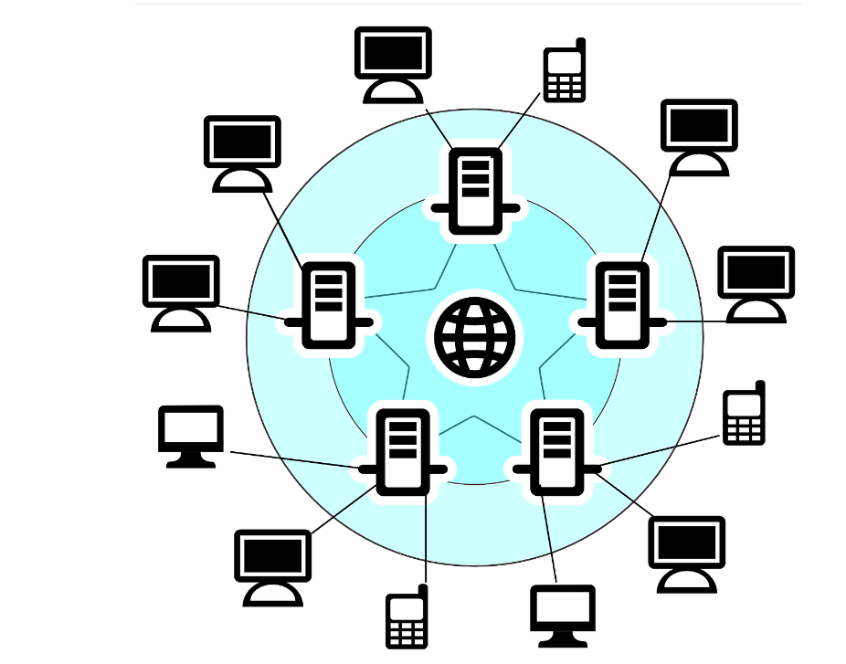
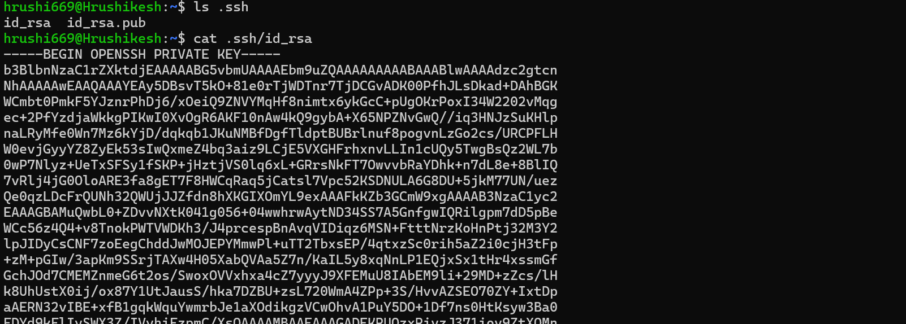
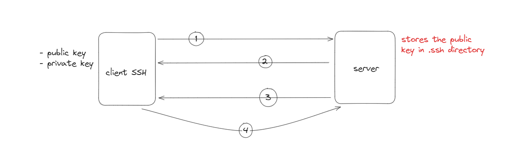

# SSH - Secure Shell 

## Introduction

 Secure Shell, is a cryptographic network protocol that allows secure communication between two systems over an unsecured network. It provides a secure channel for data transmission, remote login, and other network services. SSH operates on the client-server model, where the SSH server runs on the remote system, and the SSH client is used to access it from a local system.

 AAAhhh its just the typical definition again. lets understand the concept of SSH to get this definition into our head..

## Getting Cozy with SSH

Ever wondered how we ensure our data stays safe while transfering our data from your machine to other through the internet, i know it passes through many lanes to reach the other machine. there's a catch here, anyone in the network can access your data before reaching the reciever machine and can manipulate the data. 

alright lets picturize this..

If you think your data is safe and cannot be accessed then you are wrong, anyone connected to the network can access your data. and that's where the magic of SSH comes into play..

## Secret Tunnel

SSH creates a secure tunnel between our machine and the one we're communicating with. This tunnel is like a VIP lane in a city with huge traffic, sounds interesting right! it bypasses all the chaos and keeps our data shielded from unwanted attention.

This is all fine but how does the SSH creates a secret tunnel in this huge internet networks?

## Triple Handshake

SSH doesn't just reply on one layer protection, it employs a triple layer of protection to keep our data safe from the internet.

- Operates ad the Client - Server Model to establish a secure connection.

### SSH Keys

Firstly we need the ssh keys, but where do we get them. simple open your terminal and search for .ssh directory

- Use the below command shown in the image to check if the .ssh file exists with the public and private ssh keys for your local machine

??? note

    If not found, use command `ssh-keygen` to generate the public and private key

you can check the public and private keys using  `cat` command.

### Client-Server Connection

We generated the SSH keys already, now the steps of connection starts, as shown in the above figure we'll delve into each step understanding it clearly

1. Client sends its public key, as in you send your generated public ssh key to the server to store the key.

2. Server sends a decrypted randomly generated string to the client over the network.

3. Client uses its private key to encrypt the string and the encrypted data is sent back to the server.

4. Server then uses the shared public ssh key and decrypts the data send by the client.
    - if the decrypted data matches the randomly generated string in the step 1, the server makes a connection with the client and creates a secret tunnel. 
    - then adds the ssh key to the authorised keys directory in the server to authorize the client.

Here you go the connection is established and a secret tunnel is created. YAYYYY!

## Wrapping Up

And there you have it – the inner workings of SSH demystified! By employing encryption, authentication, and a triple handshake, SSH ensures our data remains safe and sound as it traverses the vast network of the internet.

So the next time you're zipping your data across the web, remember – SSH has got your back, keeping your digital conversations private and secure.

Stay safe, stay secure, and keep SSHing like a pro!