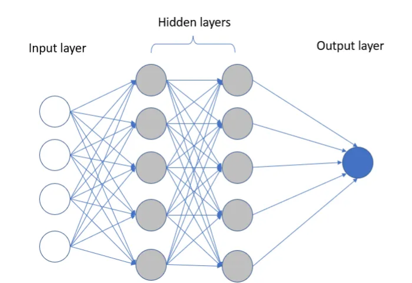

# Here’s why: To understand the layers in the best way!

>As a former data analyst enthusiast, I have always recognized the value that visualizations bring to understanding complex data. The Visuals have the power to uncover patterns, reveal insights, and communicate information in a way that mere numbers and statistics cannot.

However, my fascination with visualization didn’t stop at data alone. As I dived into the world of deep learning and neural networks, I realized the critical importance of being able to visualize the complex architectures and inner workings of these complex models.

Fortunately, Visualkeras comes to the rescue as a powerful tool that simplifies the process of visualizing deep learning models. In this blog post, we’ll delve into the world of Visualkeras and explore how it enables us to unlock the hidden secrets within our neural networks.

### the Architecture of a Neural Network 



### The main components of a neural network are

<b>Input</b> — The input is a measure of the feature of the model. In simple words, input is the set of attributes fed into the model for learning purposes.

<b>Weights</b> — Weights are similar to scalar multiplication. The primary purpose of weights in a neural network is to emphasize the attributes that contribute the most to the learning process. It is achieved by applying scalar multiplication to the input value and weight matrix. We can understand the importance of each input and the directionality from the respective weights.

<b>Transfer function</b> — The Transfer function is different from the other components because it takes multiple inputs. The transfer function combines several inputs into one output value so that the activation function can be applied.

<b>Activation Function</b> — An Activation function will transform the number from the transfer function into a value that represents the input. Most of the time, the activation function will be non-linear. Without it, the output would be a linear mixture of the input values, with no ability to incorporate non-linearity into the network. 

Two common activation functions are — ReLu and Sigmoid.

<b>Bias</b> — The purpose of bias is to change the value produced by the activation function.

An artificial neural network comprises three layers — input, output, and one or more hidden layers. Each layer consists of several neurons stacked in a row. Similarly, a multi-layer neural network consists of many layers arranged next to each other.

### Understanding the Need for Visualization

Before diving into Visualkeras, let’s briefly discuss why visualization is crucial in the context of deep learning models. Deep learning architectures can consist of numerous layers and connections, making it challenging to comprehend their inner workings. Visualizing these models helps us gain a high-level understanding of their structure, identify patterns, and pinpoint potential issues such as overfitting or underfitting.

### Introducing Visualkeras

Visualkeras is a Python library that simplifies the visualization of deep learning models using a unified and intuitive interface. It builds upon the popular Keras library and provides an interactive way to visualize the model’s architecture, making it easier to analyze and communicate complex network designs.

```py
! pip install visualkeras
```

### Visualizing Model Architecture:

With Visualkeras, we can generate comprehensive visualizations of our deep learning models. This includes visual representations of various layer types, such as convolutional layers, recurrent layers, dense layers, and more. By plotting these layers, we can observe the flow of information within the network, visualize parameter shapes, and identify potential bottlenecks or areas for improvement.

For more understanding let's build a simple model with 3 Dense layers

```py
import keras
from keras.models import Sequential
from keras.layers import Dense

model = Sequential()
model.add(Dense(12, input_dim=8, activation='relu'))
model.add(Dense(8, activation='relu'))
model.add(Dense(1, activation='sigmoid'))
```

#### To visualize the above model

```py
import visualkeras
visualkeras.layered_view(model)
```

#### The visualization of the 3 layers


Visualkeras allows us to export the visualizations in various formats, including image files (PNG, JPEG) and interactive HTML files. These export options enable us to seamlessly integrate visualizations into presentations, reports, or documentation, making it easier to convey our findings and share insights with others.

### saving the visualization in .png
```py
visualkeras.layered_view(model).save('model_visualization.png')
```

### saving the visualization as interactive html
```py
visualkeras.layered_view(model).to_html('model_visualization.html')
```
#### Practical Use Cases:

Visualkeras finds application in a wide range of scenarios. Whether you are working on image classification, natural language processing, or time series analysis, visualizing your deep learning models with Visualkeras can provide invaluable assistance in model interpretation, debugging, and fine-tuning. Additionally, it serves as a valuable educational tool for teaching deep learning concepts to students and enthusiasts.

### Conclusion

We learn and understand better when we see the process with our eyes.

>“The true understanding of a concept is attained when one observes the intricate workings of its process.”

So, why not give Visualkeras a try and unlock the hidden secrets of your neural networks?

Good luck with your Data Science journey.